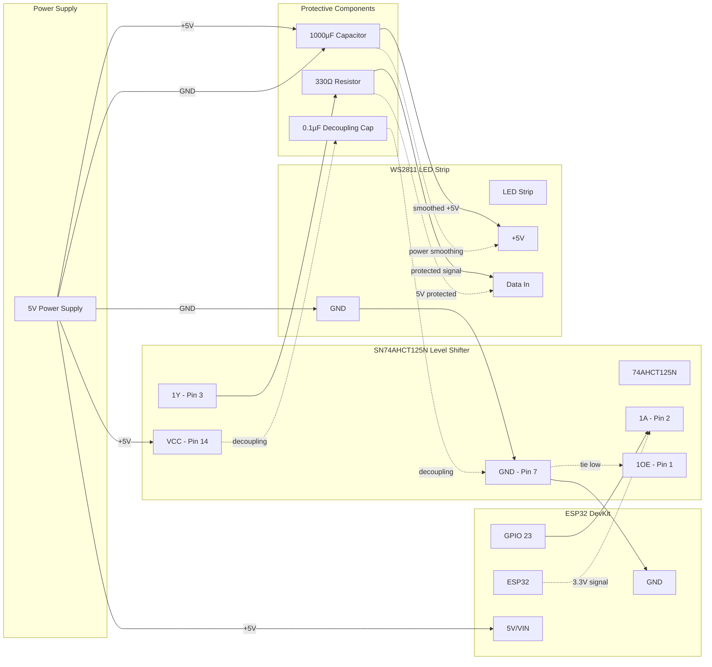

# ESP32 LED Controller

Simple WiFi-controlled LED controller for METAR map displays. Receives color commands via HTTP and controls WS2811 LED strips.

## Architecture

```
Raspberry Pi (Node.js)     WiFi     ESP32 LED Controller
┌─────────────────────┐  ◄─────►  ┌─────────────────────┐
│ • METAR parsing     │           │ • LED control only  │
│ • Flight categories │           │ • HTTP web server   │
│ • Configuration     │           │ • FastLED library   │
│ • Scheduling        │           │ • Status reporting  │
└─────────────────────┘           └─────────────────────┘
```

## Features

- **Simple HTTP API** for LED control
- **Status endpoint** for monitoring
- **Startup animation** to verify LEDs working
- **Error handling** with visual feedback
- **mDNS support** for easy network discovery
- **Minimal memory footprint** (~100 lines of code)

## Hardware Requirements

### Option A: Using Existing Custom Board (Recommended if you have one)
If you already have a custom LED controller board with:
- ✅ **Micro USB power input**
- ✅ **Built-in level shifter** (3.3V → 5V)
- ✅ **Protection resistors/capacitors**
- ✅ **LED strip output connections**

**You only need:**
- **ESP32 DevKit v1** (or compatible ESP32 development board)
- **Jumper wires** to connect data signal
- Your existing board handles all the power conditioning and level shifting!

### Option B: Building from Components

#### Essential Components:
- **ESP32 DevKit v1** (or compatible ESP32 development board)
- **WS2811/WS2812 LED strip** (your existing strip)
- **5V power supply** (adequate amperage for your LED count)
- **SN74AHCT125N level shifter** (3.3V → 5V logic level conversion)

#### Recommended Components:
- **330Ω resistor** (data line protection — Orange, Orange, Brown, Gold)
- **1000µF 6.3V+ electrolytic capacitor** (power smoothing for LEDs)
- **0.1µF ceramic capacitor** (IC decoupling - optional)

#### Breadboarding Supplies:
- **Half-size breadboard** (or larger)
- **Jumper wires** (male-to-male, male-to-female assortment)

#### Power Supply Options:
- **Option A**: Dedicated 5V PSU with barrel jack or screw terminals
- **Option B**: **USB-C breakout board** + USB-C PD charger (20W+ recommended)
- **Option C**: USB-A breakout board + 5V USB wall adapter

## Wiring

### Option A: Using Existing Custom Board

If you have a custom board like the one shown above, the wiring is much simpler:

**Current Pi Setup:**
```
Raspberry Pi ──► Blue Data Wire ──► Custom Board ──► LED Strip
     │                                   ▲
     │                                   │
     └──► Red/Black Power Wires ─────────┘
          Micro USB Power ──────────────────┘
```

**ESP32 Conversion:**
```
ESP32 GPIO23 ──► Blue Data Wire ──► Custom Board ──► LED Strip
                                        ▲
     ESP32 Power ◄── Red/Black Wires ────┘ (if 5V available)
        OR
     ESP32 ◄─── Separate USB Power
                                         
     Micro USB Power ──────────────────────┘
```

**Step-by-Step:**
1. **Keep micro USB connected** to your custom board for LED power
2. **Disconnect blue data wire from Pi** 
3. **Connect blue data wire to ESP32 GPIO23**
4. **Power the ESP32**:
   - **If red/black wires provide 5V**: Connect to ESP32 VIN and GND
   - **If red/black wires are 3.3V**: Connect to ESP32 3V3 and GND  
   - **Alternative**: Use separate USB cable to power ESP32 independently
5. **Test**: Upload code and verify LED control works

### Option B: Breadboard Build



### Wiring Details:
- **ESP32 GPIO23** → **Level Shifter Input (1A - Pin 2)**
- **Level Shifter Output (1Y - Pin 3)** → **330Ω Resistor** → **LED Strip Data In**
- **5V Power Supply** → **1000µF Capacitor** → **LED Strip +5V**
- **5V Power Supply** → **Level Shifter VCC (Pin 14)** + **ESP32 VIN**
- **Common Ground**: PSU GND → Capacitor GND → LED GND → Level Shifter GND (Pin 7) → ESP32 GND
- **Level Shifter Enable (1OE - Pin 1)** → **Tie to GND** (always enabled)
- **Optional: 0.1µF Decoupling Cap** across Level Shifter VCC (Pin 14) and GND (Pin 7)

## Breadboard Layout

### Components Needed:
- 1x ESP32 DevKit v1
- 1x SN74AHCT125N DIP-14 IC
- 1x Half-size breadboard (or larger)
- Jumper wires (male-to-male, male-to-female)
- 5V power supply with barrel jack or screw terminals

### Recommended Components:
- 1x 1000µF 6.3V+ electrolytic capacitor (power smoothing)
- 1x 330Ω resistor (data line protection)
- 1x 0.1µF ceramic capacitor (IC decoupling - optional)

### Breadboard Setup:

```
     ESP32 DevKit                    SN74AHCT125N (DIP-14)
    ┌─────────────────┐              ┌─────────────────┐
    │                 │              │  1  2  3  4  5  6  7 │
    │   GPIO23 ●──────┼──────────────┼──● Pin 2 (1A)      │
    │                 │              │                     │
    │   GND    ●──────┼──────────────┼──● Pin 7 (GND)     │
    │                 │              │  │                 │
    │   VIN    ●──────┼──────────────┼──● Pin 14 (VCC)    │
    └─────────────────┘              │  │                 │
                                     │  ● Pin 1 (1OE) ────┼── to GND rail
                                     │  ● Pin 3 (1Y) ─────┼── to LED Data
                                     │ 14 13 12 11 10  9  8 │
                                     └─────────────────┐

Power Rails:
• Red rail (+): 5V from power supply
• Blue rail (-): GND from power supply
```

### Step-by-Step Breadboard Wiring:

1. **Place SN74AHCT125N** in center of breadboard (pins 1-7 on one side, 8-14 on other)

2. **Power the IC**:
   - Pin 14 (VCC) → Red power rail (+5V)
   - Pin 7 (GND) → Blue power rail (GND)

3. **Add Power Smoothing Capacitor**:
   - 1000µF capacitor: **Positive leg** → Red power rail (+5V)
   - 1000µF capacitor: **Negative leg** → Blue power rail (GND)
   - Place close to where LED strip power connects

4. **Optional: IC Decoupling Capacitor**:
   - 0.1µF ceramic capacitor across IC power pins
   - One leg → Pin 14 (VCC), other leg → Pin 7 (GND)

5. **Connect ESP32**:
   - ESP32 VIN → Red power rail (+5V)
   - ESP32 GND → Blue power rail (GND)
   - ESP32 GPIO23 → Pin 2 (1A input)

6. **Enable the IC**:
   - Pin 1 (1OE) → Blue power rail (GND) - ties enable low

7. **Data Line with Protection Resistor**:
   - Pin 3 (1Y output) → **330Ω resistor** → LED strip data wire
   - This protects against voltage spikes and current surges

8. **LED Strip Connection**:
   - Red power rail → LED strip +5V (red wire)  
   - Blue power rail → LED strip GND (black/white wire)
   - Protected data signal → LED strip data wire (usually green/white)

9. **Power Supply Connection**:
   
   **Option A - Dedicated 5V PSU:**
   - Connect 5V PSU positive to red power rail
   - Connect 5V PSU ground to blue power rail
   
   **Option B - USB-C Breakout Board:**
   - USB-C breakout VBUS (5V) → Red power rail (+5V)
   - USB-C breakout GND → Blue power rail (GND)
   - Use 20W+ USB-C PD charger for adequate current
   
   **Option C - USB-A Breakout:**
   - USB-A breakout VCC (5V) → Red power rail (+5V) 
   - USB-A breakout GND → Blue power rail (GND)
   - Use quality 5V/3A+ USB wall adapter

### Quick Test:
- Upload the ESP32 code
- Power on - should see startup LED sweep animation
- Visit `http://metar-map.local` to test LED control

### Why These Components Matter:

#### **1000µF Power Smoothing Capacitor:**
- 🔋 **Prevents voltage drops** when all LEDs turn on simultaneously
- ⚡ **Reduces flicker** from power supply fluctuations  
- 🎯 **Critical for 29 LEDs** - they can draw 1.7A+ all at once
- 📍 **Placement**: Close to LED strip power connection

#### **330Ω Data Protection Resistor:**
- 🛡️ **Protects level shifter output** from current spikes
- 🔌 **Prevents damage** if data line shorts to power/ground
- 📺 **Improves signal quality** on longer wire runs
- ⚡ **AdaFruit recommended** - industry best practice

#### **0.1µF Decoupling Capacitor (Optional):**
- 🎛️ **Filters high-frequency noise** on IC power supply
- 🔧 **Improves digital switching** performance
- 📍 **Placement**: Directly across IC power pins (14 & 7)

### Breadboard Layout with Components:

```
Power Rails:  Red (+5V)  ━━━━━━━━━━━━━━━━━━━━━━━━━━━━━━
              Blue (GND) ━━━━━━━━━━━━━━━━━━━━━━━━━━━━━━
                              │                │
                         1000µF Cap        ESP32 Power
                         (+ to red,        
                          - to blue)       
                              │
                         Level Shifter ── 330Ω ── LED Data
                         Pin 3 output     Resistor
```

**Pro Tip**: Use different colored jumper wires - red for 5V, black for GND, yellow/green for data signals!

## Installation

1. Install Arduino IDE or PlatformIO
2. Install required libraries:
   - FastLED
   - ArduinoJson
   - ESPAsyncWebServer (optional)
3. Update WiFi credentials in `metar_led_controller.ino`
4. Set LED count and pin in configuration
5. Upload to ESP32

## API

### Update LEDs
```http
POST /update
Content-Type: application/json

{
  "leds": [
    {"index": 0, "color": [255, 0, 0]},
    {"index": 1, "color": [0, 255, 0]},  
    {"index": 2, "color": [0, 0, 255]}
  ]
}
```

### Get Status
```http
GET /status

Response:
{
  "status": "online",
  "uptime": 12345,
  "free_heap": 200000,
  "wifi_rssi": -45,
  "led_count": 29
}
```

## Node.js Integration

Add to your existing METAR processing:

```javascript
// Send LED updates to ESP32
async function updateESP32Display(lightAssignments) {
  const payload = {
    leds: lightAssignments.map(light => ({
      index: light.ledIndex,
      color: [light.red, light.green, light.blue]
    }))
  };
  
  try {
    await fetch('http://metar-map.local/update', {
      method: 'POST',
      headers: { 'Content-Type': 'application/json' },
      body: JSON.stringify(payload)
    });
  } catch (error) {
    console.error('Failed to update ESP32:', error);
  }
}
```

## Benefits

- **Reliable LED timing** - No OS interference with WS2811 protocol
- **Simple protocol** - JSON over HTTP
- **Easy debugging** - Clear status reporting  
- **Network flexibility** - ESP32 can be anywhere with WiFi
- **Minimal complexity** - Focus on LED control only
- **Future expansion** - Easy to add features later