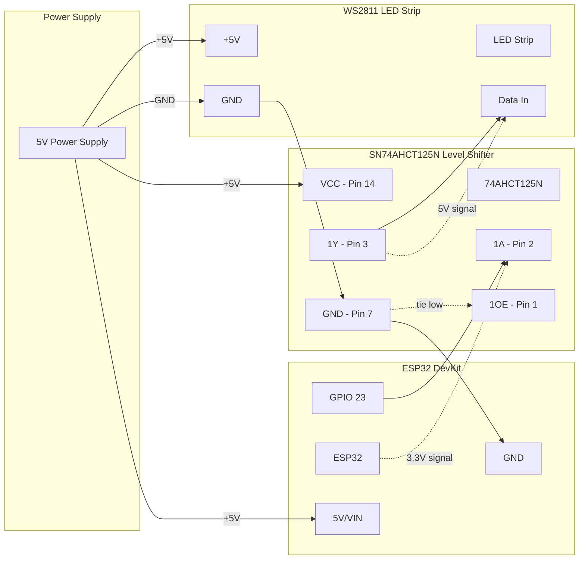

# ESP32 LED Controller

Simple WiFi-controlled LED controller for METAR map displays. Receives color commands via HTTP and controls WS2811 LED strips.

## Architecture

```
Raspberry Pi (Node.js)     WiFi     ESP32 LED Controller
┌─────────────────────┐  ◄─────►  ┌─────────────────────┐
│ • METAR parsing     │           │ • LED control only  │
│ • Flight categories │           │ • HTTP web server   │
│ • Configuration     │           │ • FastLED library   │
│ • Scheduling        │           │ • Status reporting  │
└─────────────────────┘           └─────────────────────┘
```

## Features

- **Simple HTTP API** for LED control
- **Status endpoint** for monitoring
- **Startup animation** to verify LEDs working
- **Error handling** with visual feedback
- **mDNS support** for easy network discovery
- **Minimal memory footprint** (~100 lines of code)

## Hardware Requirements

- ESP32 DevKit v1 (or similar)
- WS2811/WS2812 LED strip 
- 5V power supply
- Level shifter (3.3V → 5V for data line)

## Wiring



### Wiring Details:
- **ESP32 GPIO23** → **Level Shifter Input (1A - Pin 2)**
- **Level Shifter Output (1Y - Pin 3)** → **LED Strip Data In**
- **5V Power Supply** → **LED Strip +5V** + **Level Shifter VCC (Pin 14)** + **ESP32 VIN**
- **Common Ground**: PSU GND → LED GND → Level Shifter GND (Pin 7) → ESP32 GND
- **Level Shifter Enable (1OE - Pin 1)** → **Tie to GND** (always enabled)

## Breadboard Layout

### Components Needed:
- 1x ESP32 DevKit v1
- 1x SN74AHCT125N DIP-14 IC
- 1x Half-size breadboard (or larger)
- Jumper wires (male-to-male, male-to-female)
- 5V power supply with barrel jack or screw terminals

### Breadboard Setup:

```
     ESP32 DevKit                    SN74AHCT125N (DIP-14)
    ┌─────────────────┐              ┌─────────────────┐
    │                 │              │  1  2  3  4  5  6  7 │
    │   GPIO23 ●──────┼──────────────┼──● Pin 2 (1A)      │
    │                 │              │                     │
    │   GND    ●──────┼──────────────┼──● Pin 7 (GND)     │
    │                 │              │  │                 │
    │   VIN    ●──────┼──────────────┼──● Pin 14 (VCC)    │
    └─────────────────┘              │  │                 │
                                     │  ● Pin 1 (1OE) ────┼── to GND rail
                                     │  ● Pin 3 (1Y) ─────┼── to LED Data
                                     │ 14 13 12 11 10  9  8 │
                                     └─────────────────┐

Power Rails:
• Red rail (+): 5V from power supply
• Blue rail (-): GND from power supply
```

### Step-by-Step Breadboard Wiring:

1. **Place SN74AHCT125N** in center of breadboard (pins 1-7 on one side, 8-14 on other)

2. **Power the IC**:
   - Pin 14 (VCC) → Red power rail (+5V)
   - Pin 7 (GND) → Blue power rail (GND)

3. **Connect ESP32**:
   - ESP32 VIN → Red power rail (+5V)
   - ESP32 GND → Blue power rail (GND)
   - ESP32 GPIO23 → Pin 2 (1A input)

4. **Enable the IC**:
   - Pin 1 (1OE) → Blue power rail (GND) - ties enable low

5. **LED Strip Connection**:
   - Pin 3 (1Y output) → LED strip data wire (usually green/white)
   - Red power rail → LED strip +5V (red wire)  
   - Blue power rail → LED strip GND (black/white wire)

6. **Power Supply**:
   - Connect 5V PSU positive to red power rail
   - Connect 5V PSU ground to blue power rail

### Quick Test:
- Upload the ESP32 code
- Power on - should see startup LED sweep animation
- Visit `http://metar-map.local` to test LED control

**Pro Tip**: Use different colored jumper wires - red for 5V, black for GND, yellow/green for data signals!

## Installation

1. Install Arduino IDE or PlatformIO
2. Install required libraries:
   - FastLED
   - ArduinoJson
   - ESPAsyncWebServer (optional)
3. Update WiFi credentials in `metar_led_controller.ino`
4. Set LED count and pin in configuration
5. Upload to ESP32

## API

### Update LEDs
```http
POST /update
Content-Type: application/json

{
  "leds": [
    {"index": 0, "color": [255, 0, 0]},
    {"index": 1, "color": [0, 255, 0]},  
    {"index": 2, "color": [0, 0, 255]}
  ]
}
```

### Get Status
```http
GET /status

Response:
{
  "status": "online",
  "uptime": 12345,
  "free_heap": 200000,
  "wifi_rssi": -45,
  "led_count": 29
}
```

## Node.js Integration

Add to your existing METAR processing:

```javascript
// Send LED updates to ESP32
async function updateESP32Display(lightAssignments) {
  const payload = {
    leds: lightAssignments.map(light => ({
      index: light.ledIndex,
      color: [light.red, light.green, light.blue]
    }))
  };
  
  try {
    await fetch('http://metar-map.local/update', {
      method: 'POST',
      headers: { 'Content-Type': 'application/json' },
      body: JSON.stringify(payload)
    });
  } catch (error) {
    console.error('Failed to update ESP32:', error);
  }
}
```

## Benefits

- **Reliable LED timing** - No OS interference with WS2811 protocol
- **Simple protocol** - JSON over HTTP
- **Easy debugging** - Clear status reporting  
- **Network flexibility** - ESP32 can be anywhere with WiFi
- **Minimal complexity** - Focus on LED control only
- **Future expansion** - Easy to add features later